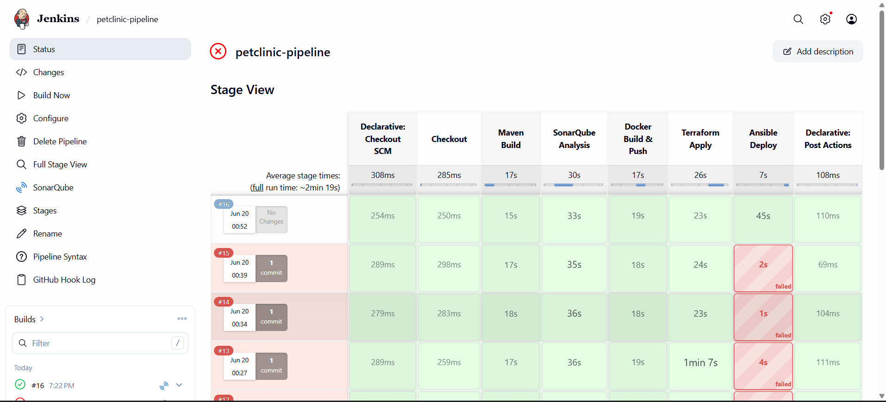
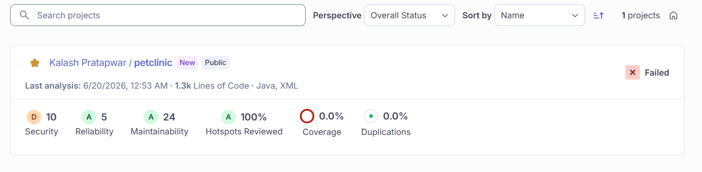
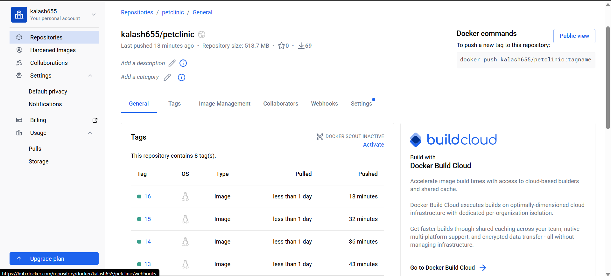
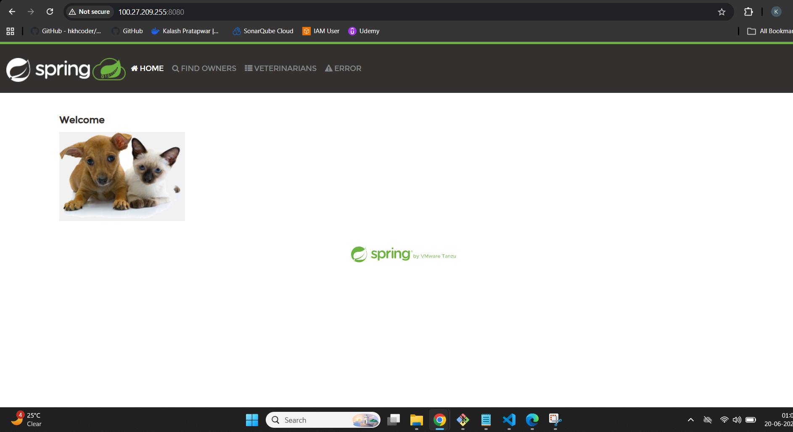

# Petclinic DevOps Pipeline

> End-to-end CI/CD pipeline for the Spring Petclinic application — fully automated from code commit to live deployment on AWS.


## Pipeline Overview

```
 Code Push → Jenkins → Maven Build → SonarQube → Docker → Terraform → Ansible → Live on AWS
```

Every push to the `main` branch automatically triggers the full pipeline. No manual steps. No manual server setup. Everything is code.


## Tech Stack

| Layer | Tool | Role |
|---|---|---|
| Source Control | Git + GitHub | Code storage and webhook trigger |
| CI/CD | Jenkins | Pipeline orchestration |
| Build | Maven | Compile and package Java app |
| Code Quality | SonarQube (SonarCloud) | Static analysis and security scan |
| Containerization | Docker | Package app as container image |
| Registry | DockerHub | Store and version Docker images |
| Infrastructure | Terraform | Provision AWS EC2, Security Groups |
| Configuration | Ansible | Install Docker, deploy container |
| Cloud | AWS EC2 | Host the running application |


## Pipeline Stages

### Stage 1 — Checkout
Jenkins pulls the latest code from GitHub automatically via webhook trigger.

### Stage 2 — Maven Build
Compiles the Spring Boot application and packages it as a JAR file.
```bash
mvn clean package -DskipTests
```

### Stage 3 — SonarQube Analysis
Scans code for bugs, vulnerabilities, and code smells. Results published to SonarCloud dashboard.

### Stage 4 — Docker Build & Push
Builds a Docker image from the JAR file and pushes it to DockerHub with the Jenkins build number as the image tag — enabling full version traceability.
```
kalash655/petclinic:15
kalash655/petclinic:14
...
```

### Stage 5 — Terraform Apply
Provisions a fresh AWS EC2 instance, security group, and networking — all from code. The EC2 public IP is captured as an output for the next stage.

### Stage 6 — Ansible Deploy
Uses the IP from Terraform to SSH into the new EC2, install Docker, pull the latest image, and run the container. Zero manual server configuration.


## Project Structure

```
spring-petclinic/
│
├── Jenkinsfile               # Full pipeline definition (6 stages)
├── Dockerfile                # Container build instructions
│
├── terraform/
│   ├── main.tf               # EC2 instance + security group
│   ├── variables.tf          # Configurable inputs
│   └── outputs.tf            # Exports EC2 public IP
│
└── ansible/
    ├── playbook.yml          # Install Docker + deploy container
    └── ansible.cfg           # Disable host key checking
```


## Screenshots

### Jenkins Pipeline — All Stages Green


### SonarQube Code Analysis


### DockerHub — Versioned Images


### Application Live on AWS



## How to Run This Project

### Prerequisites
- AWS account with IAM user (Access Key + Secret Key)
- DockerHub account
- GitHub account
- SonarCloud account

### Step 1 — Set Up Jenkins Server
Launch an Ubuntu 22.04 EC2 instance (t2.medium) and install:
- Java 17
- Jenkins
- Maven, Docker, Terraform, Ansible

### Step 2 — Configure Jenkins Credentials
Add these in Jenkins → Manage Jenkins → Credentials:

| ID | Type | Value |
|---|---|---|
| `dockerhub-creds` | Username/Password | DockerHub login |
| `aws-access-key` | Secret Text | AWS Access Key ID |
| `aws-secret-key` | Secret Text | AWS Secret Access Key |
| `github-creds` | Username/Password | GitHub token |

### Step 3 — Create Jenkins Pipeline Job
- New Item → Pipeline
- Build Triggers: GitHub hook trigger for GITScm polling
- Pipeline: Pipeline script from SCM → Git → this repo URL
- Script Path: `Jenkinsfile`

### Step 4 — Configure GitHub Webhook
- Repo → Settings → Webhooks → Add webhook
- Payload URL: `http://<JENKINS_IP>:8080/github-webhook/`
- Content type: `application/json`
- Event: Just the push event

### Step 5 — Push and Watch
```bash
git push origin main
```
Pipeline triggers automatically. Infrastructure is provisioned. App is deployed. Done.


## Key Design Decisions

**Why Terraform + Ansible instead of just one tool?**
Terraform manages *what exists* (infrastructure). Ansible manages *what's inside* (configuration). Each tool does what it's best at.

**Why Docker image versioning with build numbers?**
Every build produces a uniquely tagged image. This enables rollback to any previous version instantly — just change the tag and redeploy.

**Why store secrets in Jenkins Credentials Store?**
Credentials are never hardcoded in code. They are injected at runtime and masked in all logs — following security best practices.

**Why destroy infrastructure after each run?**
The entire environment is recreated from code on every deployment. This eliminates configuration drift and proves the infrastructure is truly repeatable.

<br/>

## Author

**Kalash Pratapwar**  
Jenkins • Terraform • Ansible • Docker • AWS  
[GitHub](https://github.com/Kalash0098)